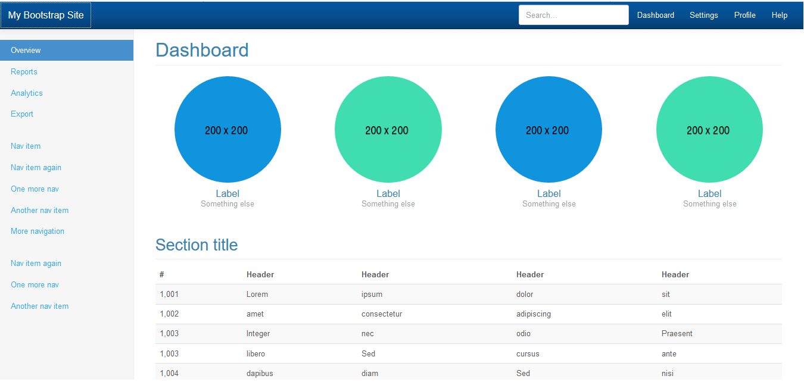

<h3 style="text-transform:none;">ASP.Net MVC BootstrapBundleは どうでしょう？</h3>
<!--
本当は、
「### タイトル」
って書きたいんだけど、それだと全部大文字になっちゃうんだよ。
設定でどうにかできるかもしれないけど、分からなかったから、こうした。
-->

　
　  
　  
　　　　id:kakisoft
---
### 自己紹介  
　  
**名前**：垣花　暁（かきのはな　さとる）    
　  
**出身**：沖縄県  
　  
**仕事**：物流系エンジニア（フリーランス）  
.NET/Java/Oracleがメイン。  
物流業界向けの言語や機器が使えます。  
　  
**趣味**：リアル脱出ゲーム
---
（作成中）
---
今回、ご紹介するのは、Visual Studioプラグインの「BootstrapBundle」についてです。
  
http://www.bootstrapbundle.com/
---
ASP.Net MVCでプロジェクトを作成すると、こんな感じのテンプレートが作成されます。
---
Bootstrap Bundleを追加すると・・・
---
こんなのとか
  
---
こんなのとか
  
---
こんなのが
  
---
  
---
  
---
プロジェクト作成時に生成できるようになります。
---
使い方
---
ツール→拡張機能と更新プログラム  
を選択し
---
「Bootstrap Bundle」を検索。  
インストールします。
---
すると、プロジェクト作成時に、  
「Bootstrap Bundle」が追加されます。
---
テーマを選択し・・・
---
カラーを選択すると・・・
---
この通り。
---
課金すると、テーマを増やすことができるみたいなんで、興味のある方は色々試してみて下さい。
---
おわり
